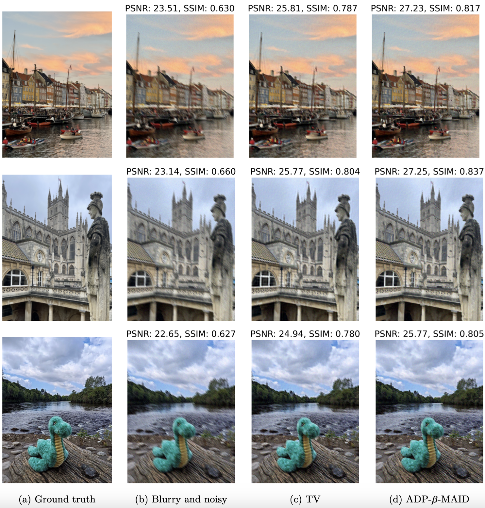
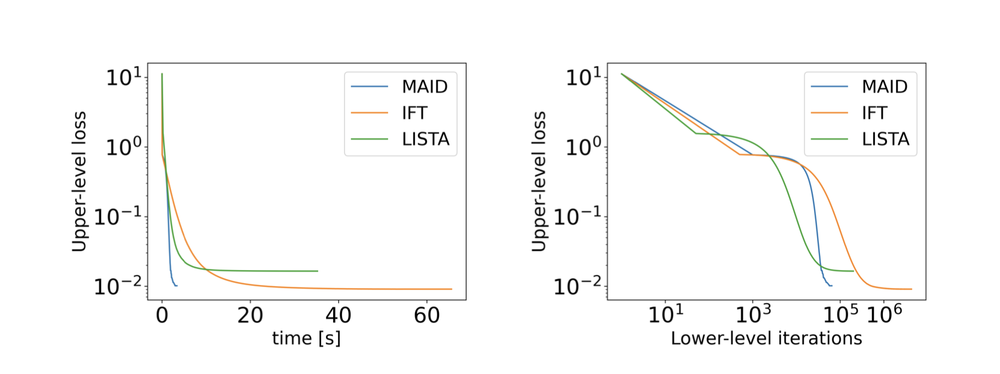
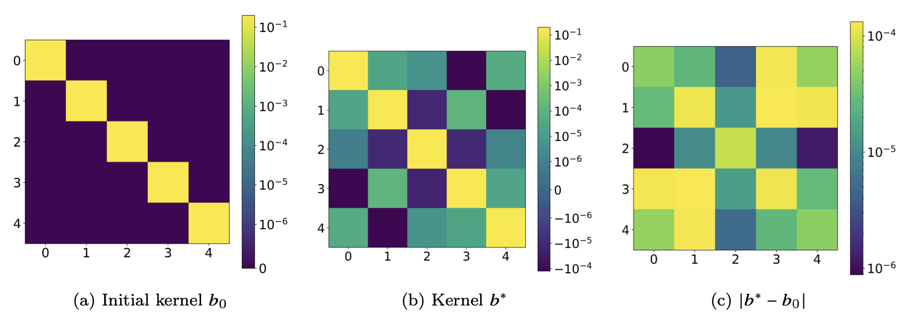

# Fast Inexact Bilevel Optimization for Analytical Deep Image Priors

This repository contains the code implementation for the fast analytical deep image priors (ADP) method presented in the paper "Fast Inexact Bilevel Optimization for Analytical Deep Image Priors" (M. S. Salehi, T. A. Bubba, Y. Korolev), accepted for presentation at the 10th International Conference on Scale Space and Variational Methods in Computer Vision (SSVM). This method leverages an analytical, explainable framework for Deep Image Priors (DIP) as a black box. It addresses the issue of extensive computations and slow behavior of traditional ADP by using the Method of Adaptive Inexact Descent (MAID) to solve the corresponding bilevel problem adaptively and cost-efficiently.

## Paper Reference
[](https://arxiv.org/abs/2412.06436)
[Fast Inexact Bilevel Optimization for Analytical Deep Image Priors](https://arxiv.org/pdf/2502.09758) (Accepted for presentation at SSVM 2025)

[Mohammad Sadegh Salehi](https://scholar.google.com/citations?user=bunZmJsAAAAJ&hl=en),
[Tatiana A. Bubba](https://scholar.google.com/citations?user=021dI38AAAAJ&hl=en), 
[Yury Korolev](https://scholar.google.com/citations?user=8ujezqwAAAAJ&hl=en), 

## Description

The code implements the Analytical Deep Priors (ADP) approach for deblurring and semi-blind deblurring of coloured images. This framework involves solving a bilevel optimisation problem, where the lower level represents variational regularisation, and the upper level incorporates MSE and Sobolev regularisation. We use Total Variation (TV) as the lower-level regulariser and model the parameters as convolutional kernels. To compare the efficiency with the pure ADP method (Arndt, 2022), we also provide 1D examples.

## Installation

1.  Clone the repository:

    ```bash
    git clone git@github.com:MohammadSadeghSalehi/Analytical-Deep-Priors.git
    cd Analytical-Deep-Priors
    ```

2.  Install the necessary dependencies:

    ```bash
    pip install numpy matplotlib scikit-image torch deepinv tqdm
    ```
    * Note: Ensure you have Python 3.6 or higher installed.
    * The following dependencies are required: `torch`, `deepinv`, `numpy`, `matplotlib`, `scikit-image`, `PIL`, `tqdm`.

## Usage

1.  **Running the main script:**

    ```bash
    python ADP.py
    ```

2.  **Modifying parameters:**

    * The `ADP.py` script contains parameters that can be adjusted to control the reconstruction process. These include:
        * `noise_level`: The level of noise in the input image.
        * `size_x` and `size_y`: The size of the input image.
        * `channels`: Determines if the image is coloured or grayscale.
        * `iterations`: The number of iterations for the reconstruction.
        * `upper_iter`: Upper-level optimisation iterations
        * `alpha`: step size
        * `eps0`: Starting accuracy of MAID
        * `setting`: Type of blur (motion, Gaussian, disc)
        * `threshold`: Stopping criterion of MAID

    * Adjust these parameters within the `ADP.py` file to experiment with different reconstruction settings.

3.  **Input Images:**
    * The images are located in the image directory and are indexed once you run ADP.py. Replace this file with your desired input image index.
4.  **Output images:**
    * The reconstructed images are saved in the same directory as the script.

## Results

## Reconstructions in deblurring with a motion blur


## Perfomance comparison 

Comparison of ADP IFT, ADP LISTA and ADP-𝛽-MAID in terms of upper-level loss as a
function of wall-clock time and lower-level iterations

## Resulting kernels

Kernels (first channel) of the 2D motion blur forward operator. (a) Initial kernel 𝑏0. (b)
Optimal kernel 𝑏∗ recovered by ADP-𝛽-MAID. (c) Difference

#
**How to cite**

    @misc{salehi2025fastinexactbileveloptimization,
      title={Fast Inexact Bilevel Optimization for Analytical Deep Image Priors}, 
      author={Mohammad Sadegh Salehi and Tatiana A. Bubba and Yury Korolev},
      year={2025},
      eprint={2502.09758},
      archivePrefix={arXiv},
      primaryClass={math.OC},
      url={https://arxiv.org/abs/2502.09758}
    
